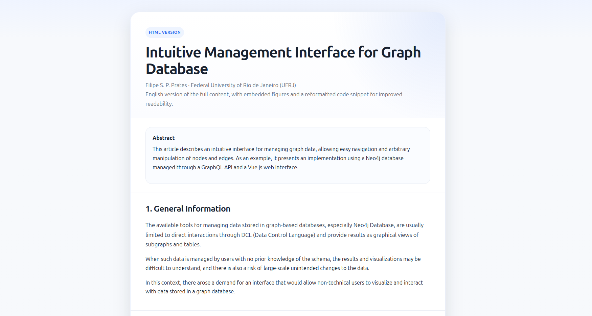

# Intuitive Management Interface for Graph Database

This repository hosts a web-friendly version of the study **“Intuitive Management Interface for Graph Database”** together with the original source material.

## Live page

GitHub Pages:

**https://filipeprates.github.io/Intuitive-Management-Interface-For-Graph-Database/**

## Overview

This project presents an intuitive interface for graph database management, focused on making graph data easier to inspect and manipulate through a more accessible web interface. The published page provides a cleaner reading experience than the PDF version, with:

- structured sections for quick navigation
- improved code snippet presentation
- embedded figures for direct browser viewing
- a one-click public URL via GitHub Pages

## Repository contents

- `index.html` — self-contained web version ready for GitHub Pages
- `Intuitive Management Interface for Graph Database.pdf` — original document
- `LaTeX/` — source material

## How to access

Open the live site:

**https://filipeprates.github.io/Intuitive-Management-Interface-For-Graph-Database/**

Or browse the repository directly:

**https://github.com/FilipePrates/Intuitive-Management-Interface-For-Graph-Database**

## Notes

The HTML version is intended to make the work easier to read, share, and reference online while preserving the original technical content.
